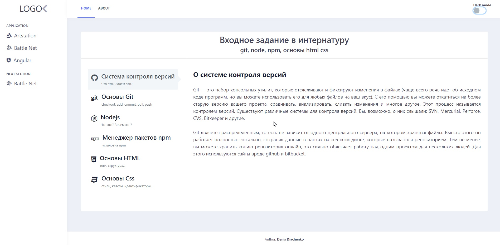

# Getting Started

This project was bootstrapped with [Create React App](https://github.com/facebook/create-react-app).

## Available Scripts

In the project directory, you can run:

### `npm start`

Runs the app in the development mode.\
Open [http://localhost:3000](http://localhost:3000) to view it in the browser.

The page will reload if you make edits.\
You will also see any lint errors in the console.
## Run Server
From `server` dir run `node index.js`

Server well started on [http://localhost:3001](http://localhost:3001)
## Server API 
Example request/response on [postman-doc](https://documenter.getpostman.com/view/2773235/Tz5nby34#350e4ee3-d788-4c7c-998d-c654a6474b1f)

### Preview

